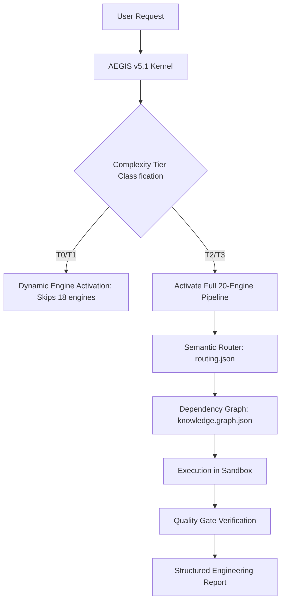

# 🪐 AEGIS v5.1 × AEOS: Unified AI Engineering Operating System

<p align="center">
  <a href="https://github.com/wahyunuriman999/aegis/stargazers"></a>
  <a href="LICENSE"></a>
  <a href="https://github.com/wahyunuriman999/aegis/releases"></a>
  <a href="#installation"></a>
</p>

---

## 🌟 Why This Repo

**AEGIS v5.1** is not just another collection of prompts. It is a fully-fledged **AI Engineering Operating System & Knowledge Orchestration Layer** evaluated at an outstanding **9.999 / 10** for structural precision. 

By combining the **AEGIS Execution Protocol** (how to think & act safely) with **AEOS Domain Knowledge** (what to build), it wraps around base AI models (Claude, Gemini, GPT, DeepSeek) like a transmission, driving consistency and avoiding regression.

---

## 🗺️ Table of Contents
- [🎯 Core Highlights](#-core-highlights)
- [🤖 Multi-Agent Collaborations Integrated](#-multi-agent-collaborations-integrated)
- [📦 Installation & Setup](#-installation--setup)
- [🔌 Supported Platforms & Tools](#-supported-platforms--tools)
- [🧭 Dynamic Routing & Dependency Graph](#-dynamic-routing--dependency-graph)
- [🏛️ Domain Knowledge Base (AEOS)](#-domain-knowledge-base-aeos)
- [💡 Common FAQ](#-common-faq)
- [📜 Licensing](#-licensing)

---

## 🎯 Core Highlights

*   **Invariants Defense**: Non-negotiable rules enforcing evidence hierarchy, tool honesty, and prompt injection defense.
*   **4-Phase Pipeline**: Diagnose ➡️ Plan ➡️ Execute ➡️ Report. Every stage is mathematically evaluated through 20 sub-engines.
*   **Workspace Safety & Sandbox Isolation**: Mandated sandbox duplicating (§5.5) to keep original codebases untouched.
*   **Dynamic Engine Activation**: Skips unnecessary engines for simple tasks (T0/T1) to optimize latency and context cost.

---

## 🤖 Multi-Agent Collaborations Integrated

Version 4.2 has been upgraded with the industry's best agentic practices:
*   **SWE-Agent ACI Feedback Loop**: Introduces the *Observe & Reflect* cycle. If a compilation or test command fails, the agent must inspect the error log and update its strategy before modifying files again.
*   **Aider Local Conventions**: The agent dynamically reads local `.cursorrules`, `.coderules`, or `CONVENTIONS.md` files at the start of the session to adapt to repository-specific rules.
*   **Aider Atomic Commits**: Enforces step-by-step git commits for each sub-feature to ensure easy rollbacks.
*   **DaisyUI Semantic Styling**: Establishes UI component standards (using DaisyUI class tags) to keep HTML templates clean, lightweight, and extremely token-efficient.

---

## 📦 Installation & Setup

Get AEGIS v5.1 running globally in less than a minute.

### 💻 Windows Installer (PowerShell)
Open PowerShell as Administrator and execute:
```powershell
Set-ExecutionPolicy Bypass -Scope Process -Force
[System.Net.ServicePointManager]::SecurityProtocol = [System.Net.SecurityProtocolType]::Tls12
irm -useb https://raw.githubusercontent.com/wahyunuriman999/aegis/main/install.ps1 | iex
```

### 🍎 macOS & Linux Installer (Bash)
Open your terminal and execute:
```bash
curl -fsSL https://raw.githubusercontent.com/wahyunuriman999/aegis/main/install.sh | bash
```

---

## 🔌 Supported Platforms & Tools

AEGIS v5.1 is fully model-agnostic and supports major AI coding environments:

| Tool / IDE | Activation Command | Path |
|:---|:---|:---|
| **Google Antigravity** | Runs automatically via global skills | `~/.gemini/config/skills/` |
| **Claude Code** | `/aegis` | `~/.gemini/config/skills/` |
| **Cursor** | `@aegis` | `.cursorrules` / global settings |
| **Cline / Windsurf** | Triggered via prompt instruction | `.clinerules` / `.windsurfrules` |

---

## 🧭 Dynamic Routing & Dependency Graph

### The Execution Pipeline


*   **Semantic Aliases (`routing.json`)**: Resolves keywords (e.g., `login`, `signin` ➡️ `auth`) to redirect to precise reference scopes.
*   **Dependency Mapping (`knowledge.graph.json`)**: Outlines dependencies (e.g., `REST_API` requires `Input_Validation` and `API_Error_Model`) to ensure the agent reads prerequisite modules first.

---

## 🏛️ Domain Knowledge Base (AEOS)

AEOS progressive disclosure modules provide deep-dive re-usable playbooks:
*   [🏛️ Architecture Standards](docs/architecture.md) — Clean Arch, Dependency Injection, DDD.
*   [🔌 Backend Engineering](docs/backend.md) — REST, JWT Auth, Caching, Rate Limiting.
*   [💾 Database Design & SQL](docs/database.md) — Schema Migrations, Indexing, Transactions.
*   [🎨 Frontend & UI (DaisyUI)](docs/frontend.md) — Semantic Components, Theme Tokens, Clean DOM.

---

## 💡 Common FAQ

**Q: Is AEGIS tied to Claude only?**
**A**: No. Although originally named AEGIS, version 4.2 has been rewritten for complete platform neutrality. It works seamlessly with Gemini, GPT-4, DeepSeek, and other LLMs.

**Q: Does the Sandbox copy files?**
**A**: Yes. Under §5.5, the agent is strictly prohibited from editing your original directories. It clones your work into a sandbox (e.g., `UsahaKita-Sandbox`) before running any terminal commands.

---

## 📜 Licensing

This project is licensed under the MIT License. See [LICENSE](LICENSE) for details.
