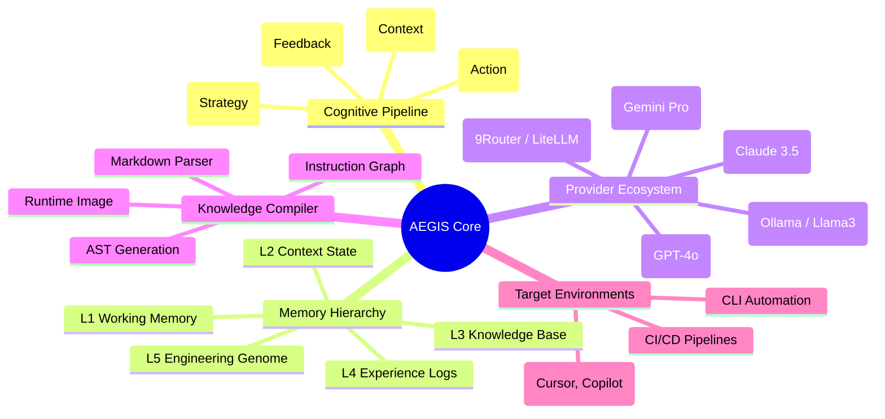

<!--
# ==========================================
# AEGIS COGNITIVE RUNTIME PLATFORM
# PROPRIETARY AND CONFIDENTIAL
# Copyright (c) 2024-2026 Wahyu Nur Iman.
# All rights reserved.
# ==========================================
-->
<div align="center">

[](https://github.com/wahyunuriman999/AEGIS-Core)
[]()
[]()
[]()

# AEGIS

### The Cognitive Runtime Platform for AI Engineering

*Engineering Intelligence Beyond the Language Model.*

[ [Architecture](#architecture) ] • [ [Installation](#installation) ] • [ [Usage](#usage) ] • [ [Tests](#tests) ] • [ [AEGIS Elite](#aegis-elite) ] • [ [FAQ](#faq) ]

</div>

---

## What is AEGIS?

**CORE PHILOSOPHY & BOUNDARIES:**
- **AEGIS Core** is strictly an **AI Engineering Engine**. It is the foundational, open-source engine. No matter how advanced it gets, it must never deviate from being the core engine mechanism.
- **AEGIS Elite** is the **AI Engineering Operating Platform**. It sits on top of the Core and is an open, full-fledged platform ready for extensive modifications, workflow orchestrations, and enterprise features.

AEGIS is a cognitive runtime layer that sits between the user and a language model. Instead of sending raw prompts, AEGIS structures reasoning into a formal pipeline — with planning, simulation, validation, and reflection — before any output is produced.

Language models are powerful, but they have no native scheduler, no memory hierarchy, and no way to enforce deterministic behavior. AEGIS adds that infrastructure.

---


### Product Map: AEGIS Core Ecosystem



---

## Architecture

AEGIS is divided into focused subsystems:

### Runtime Pipeline

```
User Intent → Planner → Scheduler → Knowledge + Genome
                                          ↓
                               Simulation → Validation
                                          ↓
                               Reflection → Memory Update → Output
```

### Kernel

Manages the lifecycle of the reasoning process.

```
Boot → Clock → Scheduler → Dispatcher → Memory → Instruction → Event Bus → Runtime Ready
```

### Memory Hierarchy

Modeled after CPU cache layers:

| Layer | Name | Contents |
|-------|------|----------|
| L1 | Working Memory | Active task context |
| L2 | Context Memory | Broader project state |
| L3 | Knowledge Memory | Engineering rules and patterns |
| L4 | Experience Memory | Past failures and successes |
| L5 | Evolution Memory | The Engineering Genome |

### Knowledge Compiler

Converts documentation and guidelines into structured runtime graphs, rather than raw prompt text.

```
Markdown → Parser → AST → Knowledge Graph → Instruction Graph → Execution Graph → Runtime Image
```

### Cognitive Instruction Set (ISA)

AEGIS executes reasoning through strict opcodes, not freeform prompts:

| Opcode | Name | Description |
|--------|------|-------------|
| `0x01` | OBSERVE | Read and understand current context |
| `0x02` | RETRIEVE | Fetch relevant knowledge |
| `0x03` | INFER | Draw conclusions from data |
| `0x04` | PLAN | Build execution graph |
| `0x05` | SIMULATE | Test plan before executing |
| `0x06` | VALIDATE | Check output against rules |
| `0x07` | EXECUTE | Apply changes |
| `0x08` | REFLECT | Review what happened |
| `0x09` | LEARN | Update memory and genome |

### Provider Layer

AEGIS routes tasks to the right model based on capability, not by name.

```
Cognitive Runtime → Provider Interface → OpenAI / Claude / Gemini / Ollama / 9Router / LiteLLM
```

---

## Current Capabilities

What is actually running today:

**1. System-Level Cognitive Injection**
AEGIS hooks into the agent's global rules via `AGENTS.md` and `SKILL.md`. It enforces a 4-tick pipeline on every task:
- Tick 1: OBSERVE
- Tick 4: PLAN
- Tick 8: EXECUTE
- Tick 9: REFLECT

**2. Event Loop Orchestration**
`kernel_runner.py` simulates the cognitive event loop, loads runtime images, and enforces the ISA.

---

## Installation

> [!WARNING]
> **Windows users:** If you see `Permission denied` during `git clone`, your terminal is probably opened in `C:\WINDOWS\System32`. Move to your user directory first (e.g., `cd $env:USERPROFILE\Documents`) before cloning.

### macOS / Linux

```bash
cd ~/Documents
git clone https://github.com/wahyunuriman999/AEGIS-Core.git
cd AEGIS-Core
pip install -r requirements.txt
python AEGIS-Runtime/kernel_runner.py --boot
```

### Windows (PowerShell)

```powershell
cd $env:USERPROFILE\Documents
git clone https://github.com/wahyunuriman999/AEGIS-Core.git
cd AEGIS-Core
pip install -r requirements.txt
python AEGIS-Runtime\kernel_runner.py --boot
```

---

## Usage

### Initialize a workspace

```bash
python AEGIS-Runtime/kernel_runner.py --init-workspace path/to/your/project
```

### Submit a task

```bash
python AEGIS-Runtime/kernel_runner.py --task "Refactor authentication module to use JWT and follow SOLID principles"
```

AEGIS runs the full pipeline (OBSERVE → PLAN → SIMULATE → EXECUTE) before touching any files.

### Compile new knowledge

```bash
python AEGIS-Compiler/build.py --ingest path/to/new/knowledge.md
```

### View execution graph

```bash
python AEGIS-Runtime/kernel_runner.py --show-graph
```

---

## Tests

AEGIS is verified through Python unit tests. Results from the latest run:

<div align="center">

[]()
[]()
[]()

</div>

### Knowledge Compiler (`build.py`)

| Metric | Result | Status |
|--------|--------|--------|
| Output Artifacts | 3 Cognitive Graphs Generated | 🟢 PASSED |
| Integrity Check | Kernel Version Validated | 🟢 PASSED |
| Compilation Time | 505.98 ms | 🟢 PASSED |

### Cognitive Kernel (`kernel_runner.py`)

| Metric | Result | Status |
|--------|--------|--------|
| Memory Mounting | L0–L5 Memory Mounted | 🟢 PASSED |
| Provider Hand-off | GPT-4o & 9Router Linked | 🟢 PASSED |
| Pipeline Execution | 9 Ticks Completed | 🟢 PASSED |
| Total Time | 6.94 seconds | 🟢 PASSED |

<details>
<summary><b>View Raw Execution Logs</b></summary>

```
[TEST] Testing Knowledge Compiler (build.py)...
Initiating AEGIS Pipeline Compiler v12.0...
Compiling Memory Snapshots & Capability Registry...
Compilation Successful! 3 output graphs generated.
       -> SUCCESS: Compiled 3 Cognitive Graphs in 505.98 ms

[TEST] Testing Cognitive Kernel (kernel_runner.py)...
[BIOS: OK] Booting AEGIS Virtual Machine v12.0...
Kernel Version: v12.0.0-executable-kernel
Loaded 6 Providers via ABI.
Mounting L0-L5 Memory Hierarchy...

--- INCOMING EVENT: UNIT TEST DIAGNOSTIC TASK ---
[Tick 1: OBSERVE] Executing Opcode 0x01...
[Tick 4: PLAN] Executing Opcode 0x04...
   -> Provider: OpenAI (GPT-4o)
[Tick 7: EXECUTE] Executing Opcode 0x07...
   -> Provider: 9Router (Gateway)

[KERNEL] Event Loop Completed Successfully.
       -> SUCCESS: Kernel executed 9-Tick Pipeline in 6.94 seconds

Ran 2 tests in 7.468s
OK
```

</details>

---

## Core vs. Elite — Honest Comparison

AEGIS-Core is the foundation. AEGIS-Elite is the full operating system built on top of it. The table below shows the differences honestly, without exaggeration:

| Capability | AEGIS-Core | AEGIS-Elite |
|---|:---:|:---:|
| **Cognitive Runtime (4-tick pipeline)** | ✅ | ✅ |
| **Knowledge Compiler** | ✅ | ✅ |
| **Memory Hierarchy (L1–L5)** | ✅ | ✅ |
| **Provider routing** (GPT, Claude, Gemini, etc.) | ✅ | ✅ |
| **Governance** | 1 layer (basic) | **5 layers** (Architecture, Security, Maintainability, Performance, Compliance) |
| **Per-commit audit trail** | ❌ | ✅ |
| **Multi-agent consensus** | ❌ | ✅ 5 agents + veto power |
| **Risk analysis before changes** | ❌ | ✅ Blast-radius scoring |
| **Cross-session cognitive memory** | Basic (L4 Experience) | ✅ 4 subsystems (ADR ledger, topology diff, learning loop, trend analysis) |
| **Governance tightens from failures** | ❌ | ✅ LearningLoop auto-tightening |
| **Extension marketplace** | ❌ | ✅ 7 domain packs |
| **Verifiable benchmark suite** | ❌ | ✅ 6 metrics vs industry baseline |
| **Enterprise compliance** | ❌ | ✅ SOC2, GDPR, RBAC, audit trail |
| **Rapid Execution Partners** | ❌ | ✅ Native Appsmith, ILLA, Teable, Noodl |
| **Execution-First Rule** | ❌ | ✅ Invariant 10 (Anti-Boilerplate) |
| **Git pre-commit hook** | ❌ | ✅ |
| **Multi-step workflow with rollback** | ❌ | ✅ |
| **Learning curve** | ⭐⭐⭐⭐⭐ (easy) | ⭐⭐⭐ (steeper) |
| **Best for** | Open source, integration, learning | Large teams, enterprise, strict regulation |

### Why Core is better for some use cases

Core is intentionally lighter — and that is its strength:

- **Easier to learn** — no extra concepts to absorb before you start
- **Easier to integrate** — drops into Cursor, Copilot, Cline, Claude Code with no extra configuration
- **Lighter maintenance** — small codebase, easy to fork and contribute to
- **Faster boot** — no overhead from governance and consensus engines

Core is the right choice if you don't need all the enterprise layers that Elite provides.

---

## AEGIS Elite

For teams that need more than the foundation, there is a premium tier called **[AEGIS Elite](https://github.com/wahyunuriman999/AEGIS-ELITE)**.

Elite is not just Core with extra features. It is a complete engineering platform that uses Core as its kernel — the same way Ubuntu uses the Linux kernel as its foundation.

What Elite actually adds:
- 5-layer governance engine that blocks problematic commits before they enter the codebase
- 5-agent AI council that debates every change, with veto rights for security and architecture
- Cognitive memory system that learns from failures and tightens governance over time
- Risk assessment that calculates the blast radius of changes before execution
- Extension packs for specific domains (React, Flutter, Laravel, Rust, Security, ML, Python)
- Enterprise compliance (SOC2, GDPR, RBAC, audit trail)
- Native Rapid Execution Engines for Low-Code/No-Code platforms (Appsmith, ILLA Builder, Teable, Noodl)
- Invariant 10: Execution-First architecture for instant functional outputs (Anti-Boilerplate)

Interested in discussing your use case and pricing?
Contact: **wahyunuriman999@gmail.com**

GitHub Elite (Private Respo): [github.com/wahyunuriman999/AEGIS-ELITE](https://github.com/wahyunuriman999/AEGIS-ELITE)

---

## Choosing Core or Elite

This is not about which is "better" in absolute terms. It is about what you need.

**Choose Core if:**
- You want to understand and experiment with AEGIS
- Your team is small (1–5 developers)
- You want to integrate AEGIS into an existing toolchain
- Open source and community contribution are priorities

**Choose Elite if:**
- Your team has 5+ developers with code standards that need centralized enforcement
- You need auditability and governance for regulatory compliance
- You need automated workflows from requirement through deployment
- Every commit must pass layered validation before reaching production

---

## FAQ

**Why not just use GPT or Claude directly?**
Language models predict tokens. AEGIS controls *how* and *when* they predict tokens — using a formal scheduler, reflection loop, and simulation layer. The LLM is the compute, not the brain.

**Why not use LangChain or CrewAI?**
Those are workflow and agent frameworks. AEGIS operates at a lower layer — it defines the Instruction Set, Memory Hierarchy, and Execution Graph that those frameworks would sit on top of.

**Why compile knowledge instead of including it in prompts?**
Sending thousands of lines of markdown into a prompt introduces noise and non-determinism. Compiling it into a graph ensures the runtime has a structured, queryable knowledge base.

---

<div align="center">

**AEGIS** — *Engineering Intelligence Beyond the Language Model.*

Copyright © 2024–2026 Wahyu Nur Iman. All rights reserved. Proprietary and Confidential.

</div>
