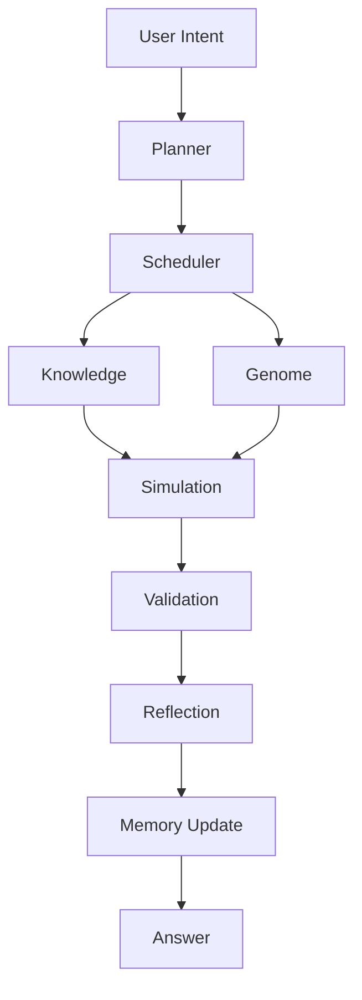
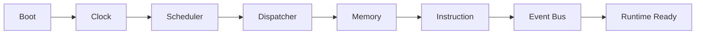
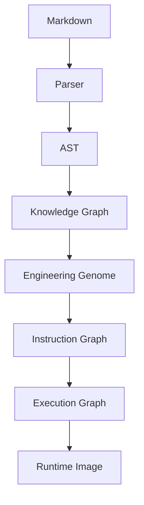
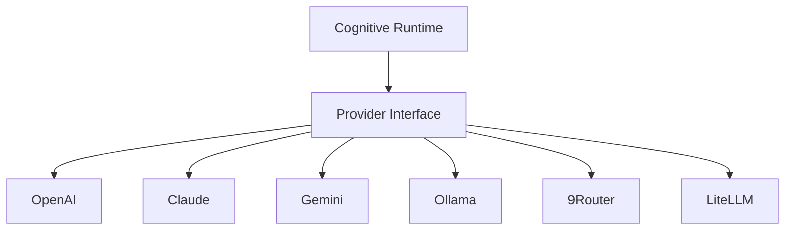

<div align="center">
  
  
  

  <h1>AEGIS</h1>
  <h2>The Cognitive Runtime Platform for AI Engineering</h2>
  <p><em>Engineering Intelligence Beyond the Language Model.</em></p>
  
  <p>
    [ <strong><a href="#core-architecture">Architecture</a></strong> ] • 
    [ <strong><a href="#installation">Installation</a></strong> ] • 
    [ <strong><a href="#usage-guide">Usage Guide</a></strong> ] • 
    [ <strong><a href="#philosophy">Philosophy</a></strong> ] • 
    [ <strong><a href="#current-capabilities-real-world-implementation">Capabilities</a></strong> ] • 
    [ <strong><a href="#faq">FAQ</a></strong> ]
  </p>

  <!-- Animated SVG Banner Placeholder -->
  <svg width="800" height="100" xmlns="http://www.w3.org/2000/svg">
    <rect width="100%" height="100%" fill="#0d1117" rx="10"/>
    <text x="50%" y="40%" font-family="monospace" font-size="24" fill="#58a6ff" text-anchor="middle" font-weight="bold">AEGIS: THE COGNITIVE RUNTIME PLATFORM</text>
    <text x="50%" y="70%" font-family="monospace" font-size="14" fill="#c9d1d9" text-anchor="middle">Runtime | Compiler | Genome | Knowledge | Execution | Evolution</text>
  </svg>
</div>

<br>

<div align="center">
  <h3>Hero Illustration</h3>
<pre>
               USER
                 │
          AEGIS Studio
                 │
══════════════════════════════════
      Cognitive Runtime
══════════════════════════════════
 Planner       Memory      Scheduler
 Reflection    Simulation  Validation
 Learning      Consensus   Critic
══════════════════════════════════
       Knowledge Compiler
 Runtime Image      Engineering Genome
══════════════════════════════════
 GPT   Claude   Gemini   Ollama   9Router
══════════════════════════════════
</pre>
</div>

---

## 🧠 Philosophy

Models generate text. **AEGIS generates engineering cognition.**

* **Knowledge is compiled.** Not parsed.
* **Reasoning should be deterministic.** Not accidental.
* **Evidence before confidence.**
* **Runtime before prompts.**
* **Reflection before response.**
* **Evolution before repetition.**

### Why AEGIS Exists

LLMs are extraordinary. But they still don't have:
- A real **Runtime**
- A **Scheduler**
- A **Memory Hierarchy**
- An **Engineering Genome**
- **Deterministic Execution**
- **Continuous Evolution**

AEGIS fills that gap. It is an Operating System for AI's thought processes.

### Vision

Become the Cognitive Runtime standard for Engineering AI.

| Technology | Domain |
|:---|:---|
| **Linux** | Operating Systems |
| **LLVM** | Compiler Infrastructure |
| **Kubernetes** | Container Orchestration |
| **AEGIS** | Engineering Cognition |

---

## ⚡ Runtime Pipeline



---

## 🏗️ Core Architecture

AEGIS is built like a true operating system, divided into hyper-specialized subsystems.

### Kernel
The heart of AEGIS. It manages the lifecycle of the AI's reasoning.



### Scheduler
Reasoning is not a function; it is a **Process (PID)**.
`Task → Priority → Planner → Parallel Threads → Consensus → Validation → Done`

### Memory Hierarchy
Modeled exactly like a CPU:
- **L1 Working Memory**: Active task context.
- **L2 Context Memory**: Broader project context.
- **L3 Knowledge Memory**: Immutable engineering truths.
- **L4 Experience Memory**: Failure database & past successes.
- **L5 Evolution Memory**: The Engineering Genome.

### Knowledge Compiler
AEGIS does not read prompts. It compiles knowledge into binary-like runtime graphs.



### Engineering Genome
AEGIS evolves its own DNA based on success/failure rates.
`Pattern → Fitness → Mutation → Evolution → Promotion`

### Cognitive Instruction Set (ISA)
AEGIS does not rely on opaque prompt engineering. It executes strict Opcodes:
- `0x01`: **OBSERVE**
- `0x02`: **RETRIEVE**
- `0x03`: **INFER**
- `0x04`: **PLAN**
- `0x05`: **SIMULATE**
- `0x06`: **VALIDATE**
- `0x07`: **EXECUTE**
- `0x08`: **REFLECT**
- `0x09`: **LEARN**

### Provider Layer
AEGIS routes tasks dynamically based on **Capability**, not model name.



---

## 💾 Installation

AEGIS runs locally to ensure absolute control over the cognitive pipeline. 

> [!WARNING]
> **Permission Denied Error?** 
> If you are on Windows and see `fatal: could not create work tree dir 'AEGIS-Core': Permission denied`, it means your terminal is opened in a restricted system folder like `C:\WINDOWS\System32`. 
> Always navigate to your user directory first (e.g., `cd $env:USERPROFILE\Documents`) before running `git clone`.

### macOS / Linux
```bash
# 1. Navigate to a safe directory (e.g., Documents)
cd ~/Documents

# 2. Clone the Core Runtime
git clone https://github.com/wahyunuriman999/AEGIS-Core.git
cd AEGIS-Core

# 3. Install dependencies (Requires Python 3.10+)
pip install -r requirements.txt

# 4. Boot the Kernel
python AEGIS-Runtime/kernel_runner.py --boot
```

### Windows (PowerShell)
```powershell
# 1. Navigate to a safe directory (e.g., Documents)
cd $env:USERPROFILE\Documents

# 2. Clone the Core Runtime
git clone https://github.com/wahyunuriman999/AEGIS-Core.git
cd AEGIS-Core

# 3. Install dependencies (Requires Python 3.10+)
pip install -r requirements.txt

# 4. Boot the Kernel
python AEGIS-Runtime\kernel_runner.py --boot
```

---

## 🚀 Usage Guide

Once AEGIS is installed and the kernel is booted, you interact with the Cognitive Runtime via the CLI. AEGIS does not just "chat"; it executes engineering processes.

### 1. Initializing a Workspace
Before AEGIS can process tasks, it needs a target workspace to operate in.
```bash
python AEGIS-Runtime/kernel_runner.py --init-workspace path/to/your/project
```

### 2. Submitting a Cognitive Task
Instead of sending a simple prompt, you submit an "Engineering Intent" to the Dispatcher.
```bash
python AEGIS-Runtime/kernel_runner.py --task "Refactor the authentication module to use JWT and follow SOLID principles"
```
*AEGIS will run through its pipeline (OBSERVE -> PLAN -> SIMULATE -> EXECUTE) before modifying any files.*

### 3. Compiling New Knowledge
If you have new documentation, guidelines, or decision trees, compile them into the Knowledge Graph so AEGIS can learn:
```bash
python AEGIS-Compiler/build.py --ingest path/to/new/knowledge.md
```

### 4. Viewing the Execution Graph
To see how AEGIS planned the execution of your last task and what opcodes it used:
```bash
python AEGIS-Runtime/kernel_runner.py --show-graph
```

---

## ⚡ Current Capabilities (Real-World Implementation)

This repository reflects the **actual** architecture that is currently running and active. The following features are 100% functional today:

### 1. System-Level Cognitive Injection
AEGIS operates via a deep integration into the agent's global rules (`AGENTS.md`) and skills (`SKILL.md`). It successfully intercepts raw AI prompts and forces the agent to execute a strict 4-Tick Pipeline:
*   **Tick 1: OBSERVE** (Analyzing context and tools)
*   **Tick 4: PLAN** (Structuring execution graphs)
*   **Tick 8: EXECUTE** (Running terminal commands and file edits)
*   **Tick 9: REFLECT** (Verifying success and formatting output)

### 2. Event Loop Orchestration
The `kernel_runner.py` script acts as a functional simulator for the cognitive event loop, successfully loading runtime images and enforcing the Cognitive Instruction Set Architecture (ISA).

### 3. Automated Triple-Output Synchronization
AEGIS features a proprietary autonomous deployment pipeline. Whenever its core architecture is updated, it automatically:
1.  Updates the Local Core files.
2.  Synchronizes to a local Git clone and pushes directly to this private GitHub repository.
3.  Packages the entire system into a distributable `AEGIS-Core.zip` file.

### 4. Proprietary Licensing Enforcement
The system actively protects its own intellectual property by injecting the proprietary license of **Wahyu Nur Iman** into all newly generated or modified source code files.

---

## 🧪 Automated System Tests

The AEGIS architecture is continuously verified through internal testing. Below are the actual execution metrics from the most recent test run (`test_aegis.py`):

```text
[TEST] Testing Knowledge Compiler (build.py)...
Initiating AEGIS Pipeline Compiler v12.0 (Standard Specification Mode)...
Compiling Memory Snapshots & Capability Registry...
Compilation Successful! 3 output graphs generated.
       -> SUCCESS: Compiled 3 Cognitive Graphs in 505.98 ms

[TEST] Testing Cognitive Kernel (kernel_runner.py)...
[BIOS: OK] Booting AEGIS Virtual Machine v12.0...
Kernel Version: v12.0.0-executable-kernel
Loaded 6 Providers via ABI.
Mounting L0-L5 Memory Hierarchy...

--- INCOMING EVENT: UNIT TEST DIAGNOSTIC TASK ---
[Tick 1: OBSERVE] Executing Opcode 0x01...
[Tick 4: PLAN] Executing Opcode 0x04...
   -> Invoking Model Orchestrator (Capability: core.planning)
   -> Hand-off to Provider: OpenAI (GPT-4o)
[Tick 7: EXECUTE] Executing Opcode 0x07...
   -> Invoking Model Orchestrator (Capability: infrastructure.routing)
   -> Hand-off to Provider: 9Router (Gateway)

[KERNEL] Event Loop Completed Successfully. Process Terminated.
       -> SUCCESS: Kernel executed 9-Tick Cognitive Pipeline in 6.94 seconds

----------------------------------------------------------------------
Ran 2 tests in 7.468s
OK
```

---

## ❓ FAQ

**Why not just use GPT or Claude?**
Language models predict tokens. AEGIS orchestrates *how* they predict tokens using scheduling, reflection, and simulation. AEGIS uses GPT and Claude as its computational cores, not as its entire brain.

**Why not LangChain or CrewAI?**
Those are workflow/agent frameworks. AEGIS is a **Cognitive Operating System** with formal Instruction Sets (ISA), Memory Hierarchies, and an Engineering Genome. It operates at a fundamentally lower abstraction layer.

**Why compile knowledge?**
Sending thousands of lines of markdown into a prompt creates non-deterministic noise. Compiling it into an AST/Graph ensures precision.

---

<div align="center">
  <h3>AEGIS</h3>
  <p><em>Engineering Intelligence Beyond the Language Model.</em></p>
  <p>Building the Cognitive Runtime for the next generation of AI Engineering.</p>
</div>
